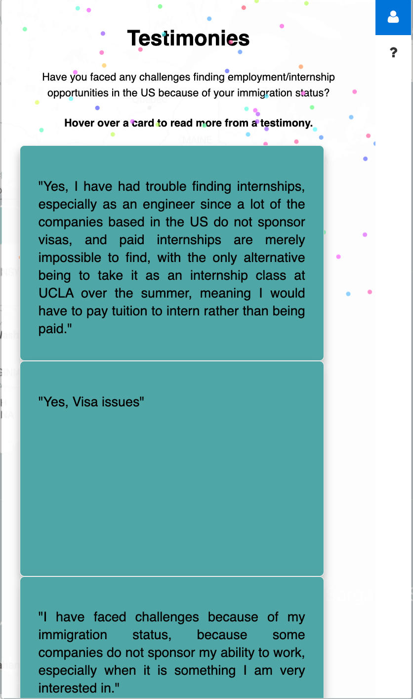
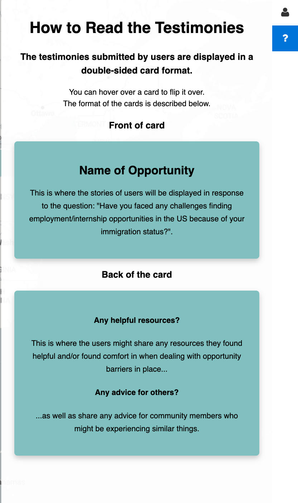
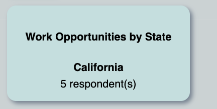

# Barriers Across Borders
### by Daiki Saito, Siew Fen Eow (Angeline), Lindsey Mardona
> We want to acknowledge that finding career opportunities in United States as an international student is significantly difficult due to the restriction of their immigration status. Therefore, we hope that our platform promote international students a sense of belonging when they are in United States and help them navigate through the difficult challenges of finding postgraduate opportunities as an international student. Therefore, we are interested in providing a platform for international students, where they can share their career-related experiences and offer advice to current and future international students. 
>
> Live demo [here](https://lindseymardona.github.io/group-8/final/index.html).

## Table of Contents ##
* [Objective](#objective_Barriers_Across_Borders)
* [Who is being empowered?](#empowered_Barriers_Across_Borders)
* [Empowered Users and Their Stories](#stories_Barriers_Across_Borders)
* [What technology was used?](#technology_Barriers_Across_Borders)
* [How it can be repurposed?](#repurposed_Barriers_Across_Borders)
* [Features & ScreenShots](#screenshots_Barriers_Across_Borders)

## 🌐 Objective ##

The goal of our project is to highlight the experiences of the graduating international students at UCLA regarding their experience with career-related opportunity barriers. We hope that by sharing the experiences of individuals with similar circumstances will alleviate their distress through solidarity and information. We want to cultivate a sense of belonging for international students who are living in unfamiliar environment.

## 🧑‍🤝‍🧑 Who is being empowered? ##

Getting an internship or a post-graduation career is one of the main objectives of students at UCLA or any university. While everyone struggles at some level with these objectives, it is particularly difficult, if not impossible, for international students due to their immigration status. Our project sets out to help provide resources for this group of international students, where little or no resources exist today. This is important because it affords these students in the US the opportunities that might be part of their dream, their goals, or even how they want to start their lives in a new country. We have personally met many international students that stress more over finding an internship than getting a good grade in their class. We believe this project will have a significant impact in not only providing very important and useful information for finding an internship or job but also bringing the international community closer in our shared pursuits of a better life.

## 💪🏼 Empowered Users and Their Stories ##

Incoming International Student: “As an incoming international student, I do not know anything about getting an internship in the United States. Being able to learn about the experiences of other foreign students through the website is very helpful”. 

Graduating International Student: “As someone who didn’t know about anything about employment restrictions for international students when I started UCLA, I want to let future international students know that creating connections among foreign students is key to finding an internship, and this website is useful for that”.

## 🧑‍💻 What technology was used? ##

Our project uses a variety of programming languages, website services and libraries to create a platform that can magnifies the voice of the international student's community. These tools facilitate the interaction among foreign students and allow them to feel less along while navigating through the challenge of finding internships/employment oppportunities in the US. 

The website for the project was built using HTML, Javascript, and CSS. Leaflet, an open-source JavaScript library for mobile-friendly interactive maps, was used to create the map and display the user stories. Papaparse was used to organize the CVS data that was collected by using Google Forms, and the locations were geocoded in Google Sheets. 

## ❔ How it can be repurposed? ##

Our website has the potential for empowering many international students for years to come since the more users we have, the larger the data samples we can collect. We hope that our platform continues to collect authentic information about internship/employment opportunities from international students explaining their real experiences going through the process. We also hope to receive feedback about our website so that we can edit it to improve user satisfaction and increase the number of users. 
Since our targeted group is international students at UCLA, we hope to distribute our website link to UCLA Dashew Center so that it can be shared with incoming international students during the summer orientation. This is a great opportunity for them to learn about the difficulty of securing internships and jobs in the US as a foreign student and start connecting with people. Also, the Global Siblings Program, hosted by UCLA Dashew Center, is an annual event where numerous international students interact with each other, which is an ideal opportunity to let them know about our website. 

## 🗺️ Web Features & Screenshots ##

### Screenshots

### An overview of our webpage
- Our webpage first briefly explains what our project is and the struggles of the community that we hope to empower.

### An overview of our homepage

- This is a screenshot of the testimonies of those who did not provide information of their career opportunity in United States. The testimonies are in the form of a flip card where front side of the card is the experience of challenges of finding employment/internship opportunities while the back side of the card is the helpful resources and advices from graduating international students.

- This is a screenshot of feature to help users to better understand how to read the testimonies.

### An overview of hover over a state
- This is a screenshot of our homepage when we hover over a state, in this case, California.

- This is a screenshot of the testimonies where the career opportunity they obtained located at California.

- This is a screenshot showing the number of respondents in the state that user hovers.

## 👥 Acknowledgements
* This project was created for Asian Am 191A: Web Development and GIS for Social Change: Critical Data for Transforming Civil Society
* Many thanks to Professor Albert Kochaphum for guiding us through every step for final project and teaching us such an interesting topic!
