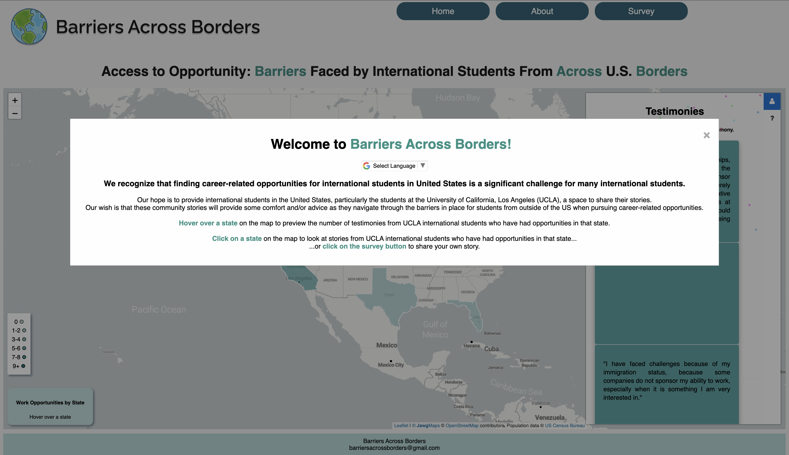
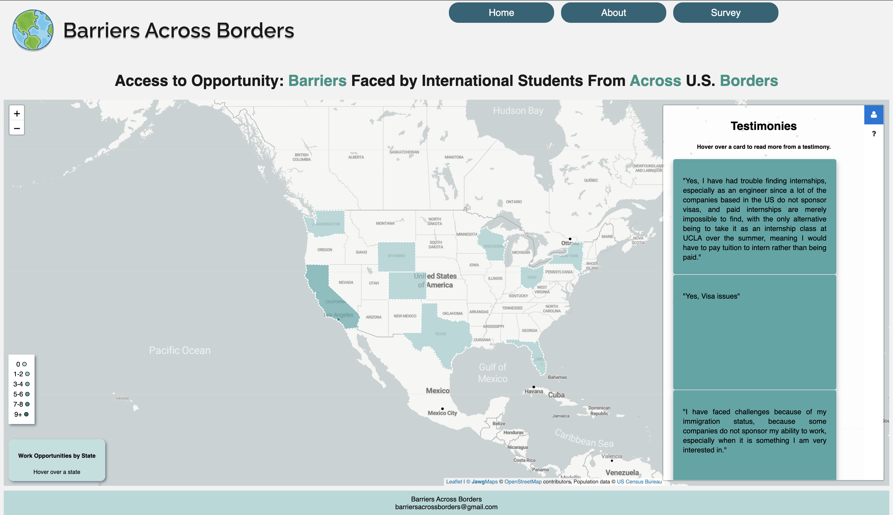

# Barriers Across Borders
### by Daiki Saito, Siew Fen Eow (Angeline), Lindsey Mardona
> Our project aims to provide a platform with international students, where they can share their experiences and give advice to current and future students about internship and employment opportunities in the United States as a student-visa holder. We recognize that finding those opportunities, on top of being a foreign student, living in an unfamiliar environment, is a significant challenge for many international students. Therefore, we hope that our platform allows students to feel connected to other students who have gone through the same process and helps them navigate through the difficult challenge of finding postgraduate opportunities as a foreign student. Our map contains information about internship and career opportunities that international students have attained, and it is specific to each state in the country. This allows students to learn about others’ experiences in specific states in which they are interested in pursuing postgraduate careers. 
>
> Live demo [here](https://lindseymardona.github.io/group-8/final/index.html).

## Table of Contents ##
* [Objective](#objective_Barriers_Across_Borders)
* [Who is being empowered?](#empowered_Barriers_Across_Borders)
* [Empowered Users and Their Stories](#stories_Barriers_Across_Borders)
* [What technology was used?](#technology_Barriers_Across_Borders)
* [How it can be repurposed?](#repurposed_Barriers_Across_Borders)
* [Features & ScreenShots](#screenshots_Barriers_Across_Borders)

## 🌐 Objective ##

We hope that by mapping the stories of graduating international students at UCLA and sharing the experiences of those who face career-related opportunity barriers will alleviate their distress regarding their future and their immigration status through solidarity and information. We aim to achieve our goal by creating a map for international students to share their experiences with employment opportunities in the US.

## 🧑‍🤝‍🧑 Who is being empowered? ##

Getting an internship or a post-graduation career is one of the main objectives of students at UCLA or any university. While everyone struggles at some level with these objectives, it is particularly difficult, if not impossible, for international students due to their immigration status. Our project sets out to help provide resources for this group of international students, where little or no resources exist today. This is important because it affords these students in the US the opportunities that might be part of their dream, their goals, or even how they want to start their lives in a new country. We have personally met many international students that stress more over finding an internship than getting a good grade in their class. We believe this project will have a significant impact in not only providing very important and useful information for finding an internship or job but also bringing the international community closer in our shared pursuits of a better life.

## 💪🏼 Empowered Users and Their Stories ##

Incoming International Student: “As an incoming international student, I do not know anything about getting an internship in the United States. Being able to learn about the experiences of other foreign students through the website is very helpful”. 

Graduating International Student: “As someone who didn’t know about anything about employment restrictions for international students when I started UCLA, I want to let future international students know that creating connections among foreign students is key to finding an internship, and this website is useful for that”.

## 🧑‍💻 What technology was used? ##

The website for the project was built using HTML, Javascript, and CSS. Leaflet, an open-source JavaScript library for mobile-friendly interactive maps, was used to create the map and display the user stories. Papaparse was used to organize the CVS data that was collected by using Google Forms, and the locations were geocoded in Google Sheets. 

## ❔ How it can be repurposed? ##

Our website has the potential for empowering many international students for years to come since the more users we have, the larger the data samples we can collect. We hope that our platform continues to collect authentic information about internship/employment opportunities from international students explaining their real experiences going through the process. We also hope to receive feedback about our website so that we can edit it to improve user satisfaction and increase the number of users. 
Since our targeted group is international students at UCLA, we hope to distribute our website link to UCLA Dashew Center so that it can be shared with incoming international students during the summer orientation. This is a great opportunity for them to learn about the difficulty of securing internships and jobs in the US as a foreign student and start connecting with people. Also, the Global Siblings Program, hosted by UCLA Dashew Center, is an annual event where numerous international students interact with each other, which is an ideal opportunity to let them know about our website. 

## 🗺️ Web Features & Screenshots ##

### Screenshots

### An overview of our webpage
- Our webpage first briefly explains what our project is and the struggles of the community that we hope to empower.

### An overview of our homepage

## 👥 Acknowledgements
* This project was created for Asian Am 191A: Web Development and GIS for Social Change: Critical Data for Transforming Civil Society
* Many thanks to Professor Albert Kochaphum for guiding us through every step for final project and teaching us such an interesting topic!
