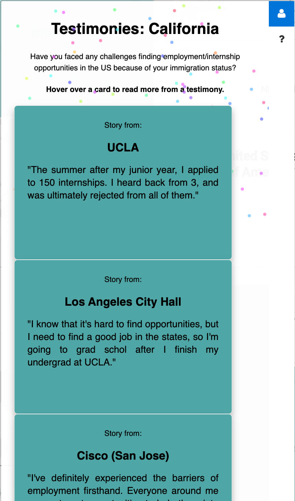

# Barriers Across Borders
### by Daiki Saito, Siew Fen Eow (Angeline), Lindsey Mardona
The live demo can be found [here](https://lindseymardona.github.io/group-8/final/index.html).

## Table of Contents ##
* [Background](#background)
* [Intent](#intent)
* [Technology Used](#technology)
* [Future Repurposing](#repurposed)
* [Features & Screenshots](#screenshots)

## 🌐 Background ##

The goal of many college students is to eventually transition into the workforce, whether it be through internships or other positions. However, the opportunity for these internships is much harder to come by for students who are not from the United States. International students are restricted in many areas due to bureaucratic restrictions that underpin the visa approval process during college and postgraduate years. For instance, the Optional Practical Training (OPT) visa, which is commonly held among international students, only permits students who have non-STEM degrees to work in the US for a year, while students who have STEM degrees can apply for the STEM OPT extension for up to another two years. This enforces strict requirements for both the international students and their employers. In addition, because the majority of employers are not willing to sponsor a work visa because of the high application fees (~$6000), extra paperwork, and the time it takes to receive an approval from USCIS (up to 2 years), many international students are not able to find career opportunities during their study in the US.

The University of California, Los Angeles (UCLA) is one of the universities with the highest number of international students, with numbers of at least 12,000. However, even with the advantage of the name brand of UCLA, most of the international students continue to face barriers when pursuing career opportunities. This can be very overwhelming to students, creating further psychological distress in addition to any potentially preexisting stress factors, such as the pressure to succeed and financial stress.

## 🧑‍🤝‍🧑 Intent ##

### Objectives ###
- Create a safe space and a community for international students at UCLA to share their testimonies regarding barriers in pursuing career-related opportunities
- Allow for other students to read and empathize with other students' stories
- Allow for groups that seek to address the needs of the international student community at UCLA to better understand their experiences
 
### Who is being Empowered ###

Our project sets out to empower the international student community at UCLA. We aim to achieve our goal by creating a map for international students to share their experiences with employment opportunities in the US. We hope that by mapping the stories of international students at UCLA, we can effectively create a safe space to share the experiences of those who face career-related opportunity barriers, as well as alleviate some of their stress regarding their future and their immigration status through solidarity and information.

### User Stories ###

- User Story 1: As a 4th year international student at UCLA who has been fortunate enough to receive a job offer after graduation through the many barriers in place for students living abroad in the US, I want to talk about my experiences to hopefully give other struggling international students ideas of where to look for employment opportunities. With this map that shows my story as well as my email address, I hope to communicate with other international students who may want someone to talk to about their struggles in finding employment opportunities in the US.
- User Story 2: As an anxious 4th year international student at UCLA who wants to stay in the US even after graduation, I want to listen to other people’s stories so that the solidarity that they voice might help me feel less alone in the struggles I face because of my non-citizenship.
- User Story 3: As one of the staff members at UCLA Dashew Center who interacts with international students on a daily basis, I recognize that many of them are anxious about their post-graduation plans because of the immigration barriers. I believe that sharing their concerns and worries about their plans on the map will help them feel less alone because the map will likely be filled with many of their concerns, illustrating how common it is for international students to go through immigration problems.

## 🧑‍💻 Technology Used ##

Our project uses a variety of programming languages, website services, and libraries in order to create a platform that seeks to magnify the voices of the international student community at UCLA and share their experience regarding career-related opportunities barriers in the United States. Our hope is to facilitate an interaction between international students and provide them with a sense of belonging, even while they are in a foreign environment, navigating through systematic barriers that prevent them from accessing opportunities as easily as students from within the country.

We utilized Google Forms, Google Sheets, HTML/CSS, Javascript, Leaflet, and other open-source JavaScript libraries in order to build our mapplication.
- **Google Forms** is used to collect the community stories that will be mapped and displayed on the home page. 
- **Google Sheets** is used to store information collected from the Google Forms, using the Geocoding API from Google to geocode the locations submitted by users. 
- **Javascript** is used to display the collected testimonies and associate them with a hoverable state on the web map, integrating the information from the zip code submitted. It is also used to make additions to the Leaflet map that align with our objective, as well as create a sidebar that displays the testimonies and the instructions on how to read the testimonies.
- **HTML/CSS** are both used to create the layout of the web page and web map. It also enables navigation from one web page to another. J
- **Leaflet** is used to produce an interactive map which displays the information from the responses to the survey that is associated with latitude/longitude values. - **Papaparse** is used to parse through the .csv file generated by Google Forms.
- **Other Libraries** were used to implement site functionality, namely [leaflet-sidebar-v2](https://github.com/noerw/leaflet-sidebar-v2) to display the flippy cards containing the testimonies.

## ❔ Future Repurposing  ##

Our website has the potential for empowering many international students for years to come since the more users we have, the larger the data samples we can collect. We hope that our platform continues to collect real and detailed community stories about internship/employment opportunities from international students explaining their real experiences going through the process. We also hope to receive feedback about our website so that we can improve user satisfaction and reach a wider range of audience.
 
Since our targeted group is international students at UCLA, we intend to distribute our project to the UCLA Career Center and student-based organizations at UCLA such as alumni associations and International Student Association (ISA) at UCLA which focus on international students, to expand on this project and assist the graduating students both practically and mentally. Besides that, the Global Siblings Program, hosted by UCLA Dashew Center, is an annual event where numerous international students interact with each other, which may be an ideal opportunity to share our site and survey.

Since our site was built on open source tools for accessibility purposes, if this project was to be repurposed or passed off to another organization, it would come at no financial cost. The only requirement is to have a Google account to maintain the Google Form and the Google Sheet. However, we do request that all future projects derived from this one to remain open source and visible to the public.

## 🗺️ Web Features & Screenshots ##

### An overview of our webpage
- ​​When a user enters our website, there is a popup message explaining what our project is, who we want to empower, and how to use the website and take the survey. It is a brief description of our overall project and its objectives.

### An overview of our homepage
- On the top left of the website, there is our group name: "Border Across Barriers". And on the other side of the screen, there are buttons that take the user to 1) the homepage (Home), 2) the about page (About), which explains the background information of our project, and 3) the Google Form to add user experience (Survey). 
- The main part of the website is the map and its features, which are found in the center of the screen.

- This is a screenshot of the testimonies of those who did not provide information of their career opportunity in the United States. The testimonies are in the form of a flip card where the front side of the card is the experience of challenges of finding employment/internship opportunities while the back side of the card is the helpful resources and advice from graduating international students.

- This is a screenshot of the feature that helps the user better understand how to read the testimonies. The front card contains information about the organization for which survey-takers worked for and their intern/job titles. It also demonstrates what kind of challenges, if any, they faced when looking for employment opportunities in the US as a foreign student. The back of the card, on the other hand, includes tips and advices that could be helpful for current/future international students when going through the process of finding an internship or job. 

### An overview of hover over a state
- This is a screenshot of our homepage when we hover over a state, in this case, California.

- This is an example of the testimonies that shows that some of the survey-takers worked or did their internships in California and their experiences, as well as helpful information or advice for future users of the website. 

- This screenshot shows the number of respondents in each state where international students previously worked or did their internships.

## 👥 Acknowledgements
* This project was created for Asian Am 191A: Web Development and GIS for Social Change: Critical Data for Transforming Civil Society
* Many thanks to Professor Albert Kochaphum for guiding us through every step for final project and teaching us such an interesting topic!
